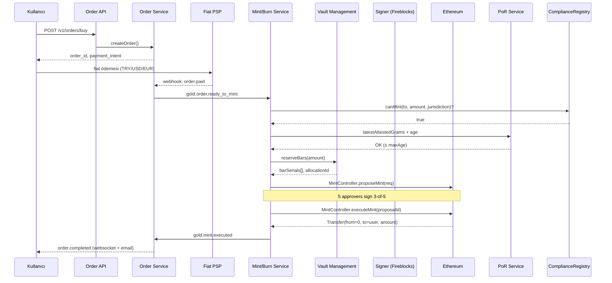
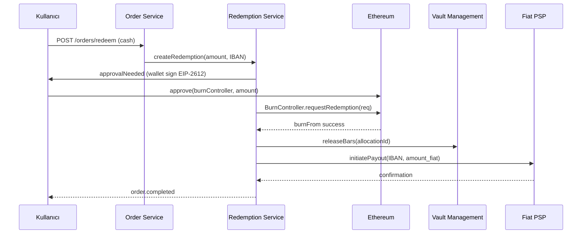

# GOLD Backend Spesifikasyonu

**v0.1 · Nisan 2026 · GİZLİ**

Bu doküman, [`system-design.md`](../system-design.md) Bölüm 6'nın derinlemesine teknik spesifikasyonudur. Akıllı sözleşmelerin (`docs/contracts/README.md`) üzerine oturan **off-chain servis mimarisini** tanımlar.

---

## İçindekiler

1. [Tasarım İlkeleri](#1-tasarım-İlkeleri)
2. [Repository Yapısı](#2-repository-yapısı)
3. [Tech Stack](#3-tech-stack)
4. [Ortak Altyapı](#4-ortak-altyapı)
5. [Servis Envanteri](#5-servis-envanteri)
6. [API Tasarım Konvansiyonları](#6-api-tasarım-konvansiyonları)
7. [Event Bus: NATS Subject Taksonomisi](#7-event-bus-nats-subject-taksonomisi)
8. [Kritik Yol: Mint Saga](#8-kritik-yol-mint-saga)
9. [Kritik Yol: İtfa Saga](#9-kritik-yol-İtfa-saga)
10. [Veritabanı Şeması](#10-veritabanı-şeması)
11. [Güvenlik Katmanı](#11-güvenlik-katmanı)
12. [Gözlemlenebilirlik](#12-gözlemlenebilirlik)
13. [Dağıtım](#13-dağıtım)
14. [Geliştirme Akışı](#14-geliştirme-akışı)

---

## 1. Tasarım İlkeleri

1. **Zincir tek kaynak, DB ayna** — Token durumu (bakiye, arz, onaylar) zincirde. Backend DB zincirden index'ler, asla ters yönde doğrulama yapmaz.
2. **Idempotent by default** — Her mutatif istek `Idempotency-Key` taşır. Aynı tuşla iki kez gelen istek tek kez yürütülür.
3. **Saga > 2PC** — Cross-service atomicity sağa ile sağlanır; her adımın compensation fonksiyonu var.
4. **Outbox pattern** — Her servis DB commit + event publish atomik olmalı. Outbox tablosu + CDC worker.
5. **Her servis bounded context** — Tek bir sorumluluk alanı, tek DB schema'sı. Servisler arasında DB paylaşımı yok.
6. **Veri ikametgâhı birinci sınıf** — TR kullanıcı PII'si TR region içinde kalır. GDPR/KVKK/nDSG dört ayrı veri bölgesi ister.
7. **12-factor** — Config env'den, stateless servis, log stdout'a, graceful shutdown.
8. **Production'da insan müdahalesi min** — Runbook'lar, otomatik rollback, kanarya dağıtım.

---

## 2. Repository Yapısı

Monorepo. Servisler aynı kod tabanında — shared libs, birleşik CI, atomic cross-service değişiklikler.

```
gold-token/
├── contracts/                  ✅ mevcut — Solidity + Foundry
├── docs/                       ✅ mevcut
├── backend/                    ← bu bölümün konusu
│   ├── go.work                 # multi-module workspace
│   ├── services/
│   │   ├── auth/
│   │   ├── kyc/
│   │   ├── wallet/
│   │   ├── order/
│   │   ├── mint-burn/          # kritik yol
│   │   ├── redemption/
│   │   ├── price-oracle/
│   │   ├── por/                # proof-of-reserve
│   │   ├── compliance/
│   │   ├── notification/
│   │   └── reporting/
│   ├── pkg/                    # servisler arası paylaşılan Go paketleri
│   │   ├── chain/              # zincir istemci (ethers wrapper)
│   │   ├── events/             # NATS wrapper
│   │   ├── outbox/
│   │   ├── idempotency/
│   │   ├── auth/               # JWT/OIDC middleware
│   │   ├── obs/                # observability (otel, log, metric)
│   │   ├── errors/
│   │   └── db/                 # pgx wrapper, migrate
│   ├── api/                    # API contracts
│   │   ├── openapi/            # REST spec (split per arena)
│   │   ├── proto/              # gRPC (internal)
│   │   └── events/             # async event schemas (JSON Schema)
│   ├── infra/
│   │   ├── terraform/
│   │   ├── k8s/
│   │   └── migrations/         # DB migrations (sqlc + goose)
│   └── scripts/
├── frontend-web/               # Next.js (gelecek)
├── mobile-ios/                 # Swift (gelecek)
├── mobile-android/             # Kotlin (gelecek)
└── platform/
    ├── verify-portal/          # verify.gold.example
    └── institutional-api-docs/
```

### 2.1 Go workspace

```
// go.work
go 1.22
use (
    ./backend/services/auth
    ./backend/services/kyc
    ./backend/services/wallet
    ./backend/services/order
    ./backend/services/mint-burn
    ./backend/services/redemption
    ./backend/services/price-oracle
    ./backend/services/por
    ./backend/services/compliance
    ./backend/services/notification
    ./backend/services/reporting
    ./backend/pkg/chain
    ./backend/pkg/events
    ./backend/pkg/outbox
    ./backend/pkg/idempotency
    ./backend/pkg/auth
    ./backend/pkg/obs
    ./backend/pkg/errors
    ./backend/pkg/db
)
```

---

## 3. Tech Stack

| Katman | Seçim | Neden |
|---|---|---|
| Dil | Go 1.22 | Konkurans, tek binary dağıtım, olgun ekosistem |
| HTTP framework | Chi + stdlib | Minimal, idiomatic |
| gRPC | grpc-go + protoc | Internal RPC |
| DB | PostgreSQL 16 | ACID, JSON, partitioning |
| Query builder | sqlc (generate) | Type-safe, reflection'sız |
| Migrations | goose | Reversible, up/down |
| Cache | Redis 7 | Session, rate-limit, idempotency |
| Events | NATS JetStream | Lightweight, exactly-once semantics |
| Search | OpenSearch | Compliance log, audit trail |
| Zincir | ethers.js via grpc-web → Go client (go-ethereum) | Direct RPC, type-safe bindings via abigen |
| Signer | Fireblocks SDK (primary) / HSM (fallback) | MPC wallet, policy engine |
| Observability | OpenTelemetry | Vendor-agnostic |
| Logs | Zap | Structured, zero-alloc |
| Test | testify + gomock + testcontainers | Standard, kısa geri bildirim |

### 3.1 Neden Go (TypeScript değil?)

- Mint saga'da blockchain RPC + DB + NATS paralel koordinasyon → Go goroutine'ler net
- Sayısal hassasiyet (big.Int for wei) — JavaScript'te BigInt bug'ları yaygın
- Tek binary = dev/prod parite, hızlı dağıtım
- Fireblocks SDK Go'da birinci sınıf vatandaş

TypeScript yalnızca: frontend, BFF (Next.js API routes), bazı scripting.

---

## 4. Ortak Altyapı

### 4.1 Auth middleware (`pkg/auth`)

Her public API isteğinde:
1. JWT doğrulama (Keycloak signing key, RS256)
2. Scope kontrolü (`scope:buy`, `scope:sell`, `scope:admin` vb.)
3. Arena header doğrulama (`X-GOLD-Arena: TR|CH|AE|EU`) — cross-arena istek reddedilir
4. Rate limit (Redis token bucket — user + IP per endpoint)
5. İstek günlüğü (OpenTelemetry span)

### 4.2 Idempotency (`pkg/idempotency`)

```
# Her mutatif endpoint
Header: Idempotency-Key: <uuid>

# Flow
1. Key → hash(body) → Redis SET NX with 24h TTL
2. Key varsa ve hash aynıysa: cached response döndür
3. Key varsa ama hash farklıysa: 409 Conflict
4. Yoksa: işle, response'u cache'e yaz
```

### 4.3 Outbox (`pkg/outbox`)

```sql
CREATE TABLE outbox (
    id uuid PRIMARY KEY,
    aggregate_id text NOT NULL,
    subject text NOT NULL,     -- NATS subject
    payload jsonb NOT NULL,
    created_at timestamptz NOT NULL DEFAULT now(),
    published_at timestamptz
);
```

Worker her 1s outbox'tan publish. `published_at IS NULL` kuyruğu. NATS başarılı → `published_at = now()`. PostgreSQL LISTEN/NOTIFY ile real-time.

### 4.4 Hata yönetimi (`pkg/errors`)

Tüm hatalar coded:
```go
type Error struct {
    Code     string          // GOLD.ORDER.001
    Message  string          // "Minimum order amount is 1 gram"
    HTTP     int             // 400
    Retryable bool           // idempotent retry güvenli mi
    Meta     map[string]any  // {"min":"1000000000000000000","requested":"500000000000000000"}
}
```

Error code taksonomisi: `GOLD.<DOMAIN>.<NUMBER>`.
Her kod dokümante: [`docs/backend/error-codes.md`](./error-codes.md) (TBD).

### 4.5 Config

12-factor env:
```
DATABASE_URL=
REDIS_URL=
NATS_URL=
JWT_JWKS_URL=
CHAIN_RPC_URL=
CHAIN_ID=1
FIREBLOCKS_API_KEY_FILE=
...
```

Secrets: AWS Secrets Manager + HashiCorp Vault. In-code: `pkg/config` yükler.

### 4.6 Observability (`pkg/obs`)

- **Tracing**: OpenTelemetry → Datadog APM
- **Logs**: structured JSON → Datadog Log
- **Metrics**: Prometheus → Datadog Metric
- **Tüm HTTP request → trace_id**; event publish sırasında trace context propagate

Kritik SLO'lar:
- API p99 latency < 300ms
- Mint saga end-to-end < 5min (happy path)
- Event bus publish lag < 1s
- DB connection failure → < 5s failover

---

## 5. Servis Envanteri

### 5.1 Auth Service
Keycloak realm ile entegrasyon; token endpoint'i yok, sadece profile + 2FA yönetimi. OIDC/OAuth2 akışı Keycloak'ta.

### 5.2 KYC Service
Sumsub + Jumio dual integration. Webhook → risk skorla → ComplianceRegistry yaz. TR için MERNİS/e-Devlet, UAE için UAE PASS.

### 5.3 Wallet Service
- **Custodial**: Fireblocks vault hesapları. Kullanıcı bazlı veya arena bazlı omnibus + allocation mapping.
- **Self-custody linking**: Kullanıcı imza ile adres bağlar (`personal_sign` challenge). Bağlı adres → ComplianceRegistry profili açılır.

### 5.4 Order Service
Alım/satım/itfa sipariş durum makinesi. Fiat PSP entegrasyonu (İyzico/Stripe/SEPA). Tahsis API'si Mint/Burn Service'e delege.

### 5.5 Mint/Burn Service ⭐
**Kritik yol** — Bölüm 8 ve 9'da detayda. Saga orchestrator.

### 5.6 Physical Redemption Service
Kargo ortaklığı (Brink's / Loomis), IML pre-clearance. `BurnController.requestRedemption` tetikler.

### 5.7 Price Oracle Service
Chainlink aggregator + iç fallback (LBMA + kısmen Borsa İstanbul KMP). TimescaleDB'ye yazar, WebSocket broadcast.

### 5.8 PoR Service ⭐
Kasa API'lerinden aylık anlık görüntü → Merkle ağacı → Big Four denetçi imzası → IPFS yayını → `ReserveOracle.publish`.

### 5.9 Compliance Engine
Kurallar motoru (Drools tarzı — kural dosyaları, gözetim gerektirmeden güncellenebilir). Tüm event stream'i dinler, alert üretir.

### 5.10 Notification Service
E-posta (SES) + SMS (MessageBird) + Push (APNS/FCM) + in-app. Template sistemi.

### 5.11 Reporting Service
Planlı rapor üretimi (CMB günlük, MASAK SAR, FINMA üç aylık, vergi yıllık). CSV/PDF/XBRL formatları.

---

## 6. API Tasarım Konvansiyonları

### 6.1 URL

```
https://{arena}.api.gold.example/v1/{resource}
```

`arena ∈ {tr, ch, ae, eu}`. Cross-arena istekler 400 döner.

### 6.2 Versiyonlama

URL'de major (`/v1`). Minor breaking olmayan eklemeler, breaking → yeni major.

### 6.3 Response zarfı

Başarılı:
```json
{ "data": { ... }, "meta": { "request_id": "..." } }
```

Hata:
```json
{
  "error": {
    "code": "GOLD.ORDER.001",
    "message": "Minimum order amount is 1 gram",
    "details": { "min": "1000000000000000000", "requested": "500000000000000000" }
  },
  "meta": { "request_id": "..." }
}
```

### 6.4 Pagination

Cursor-based, opaque. `?cursor=...&limit=50`. Max limit 200.

### 6.5 Tarih ve sayılar

- Tarih: RFC3339 UTC (`2026-04-17T12:34:56Z`)
- Para: string `"1000000000000000000"` (wei cinsinden; 18 decimals)
- TRY/USD: string `"1234.56"`

### 6.6 Webhooks

Dış sistemler için iki yön:
- **Gelen**: KYC vendor callback, PSP callback — HMAC signature + idempotency
- **Giden**: Kurumsal API kullanıcıları — order completion, redemption executed; HMAC signed, exponential retry

---

## 7. Event Bus: NATS Subject Taksonomisi

```
gold.{domain}.{event_name}.v{version}
```

### 7.1 Domain envanteri

| Domain | Alt-subject örnek |
|---|---|
| `user` | `kyc.approved`, `kyc.rejected`, `kyc.expired` |
| `wallet` | `created`, `linked`, `frozen` |
| `order` | `created`, `paid`, `cancelled`, `completed` |
| `mint` | `proposed`, `approved`, `executed`, `failed` |
| `burn` | `requested`, `executed`, `failed` |
| `redemption` | `submitted`, `physical.dispatched`, `delivered` |
| `reserve` | `snapshot.captured`, `attestation.published` |
| `compliance` | `alert`, `freeze`, `sar.generated` |
| `price` | `updated` (high-volume → ayrı stream) |

### 7.2 Stream konfigürasyonu

- Retention: 7 gün (arşiv için S3'e sürekli sink)
- Ack policy: Explicit (consumer'lar ack eder)
- Max deliver: 5 (sonra DLQ)
- Deduplication window: 2 dk (message-id ile)

### 7.3 Event zarfı

```json
{
  "event_id": "uuid-v7",
  "event_type": "gold.mint.executed.v1",
  "occurred_at": "2026-04-17T12:34:56Z",
  "aggregate_id": "mint-op-uuid",
  "causation_id": "...",        // tetikleyen event
  "correlation_id": "...",      // saga ID
  "version": 1,
  "data": { ... }
}
```

---

## 8. Kritik Yol: Mint Saga

Bu akış sistemin en hassas yeridir. Her aşama kompansasyonlu.

### 8.1 Akış diyagramı



### 8.2 Sipariş durum makinesi

```
CREATED → PAYMENT_PENDING → PAID
  → RESERVING_BARS → MINT_PROPOSED → MINT_EXECUTED
  → COMPLETED

Herhangi bir adımdan → CANCELLED (compensation tetiklenir)
```

### 8.3 Compensation tablosu

| Adım | Başarısız olursa | Compensation |
|---|---|---|
| `reserveBars` | Kasa müsait değil | Order'ı `FAILED_NO_STOCK` yap; ödemeyi iade |
| `proposeMint` | RPC hatası | 3 retry → manuel triage |
| `approvals` | Eşik yetmedi (timeout 4h) | Kasa rezervasyonu serbest bırak; ödeme iade |
| `executeMint` | İnvariant ihlali | Kasa rezervasyonu serbest; ödeme iade; **olay: PoR mismatch — incident** |
| Token mint başarılı | sonradan ortaya çıkan uyum sorunu | `operatorBurn` + ödeme iade (dual control) |

### 8.4 Atomic mint marker

Her saga için DB'de bir `saga_instance`:
```
id uuid PK
saga_type text                   -- "mint" | "redeem"
state enum
current_step text
context jsonb                    -- tüm ara değişkenler
started_at, last_step_at, completed_at
```

Worker crash'inde başka worker pickup yapar — context DB'de. `state` geçişleri atomic SQL UPDATE.

### 8.5 Rezerv bar tahsisi

```
1. SELECT FOR UPDATE SKIP LOCKED gold_bars
   WHERE status='in_vault' AND vault_id=(preferred vault for arena)
   AND weight_grams - allocated_sum >= amount
2. Tahsis kaydı: bar_allocations insert
3. gold_bars.allocated_sum += amount
4. Tek TX'de commit
```

Concurrent mint'ler farklı çubukları rezerve eder. Tek çubuk birden çok tahsisi destekleyebilir (fractional allocation) ama toplam ≤ weight.

### 8.6 On-chain approval orkestrasyonu

5 approver ayrı süreç:
- **Otomatik approver** (AI/uyum bot) — basit kurallar geçerliyse imza
- **Hazine** — gün içinde 10M+ USD mint'lerde manuel
- **Uyum müdürü** — jurisdiction kontrolü
- **Teknik** — smart contract event doğrulama
- **Bağımsız** — üçüncü taraf imza servisi (gelecek)

Her approver'ın bekleme süresi: 4 saat SLA. 4 saat içinde 3 onay gelmezse escalation.

---

## 9. Kritik Yol: İtfa Saga

Kullanıcı tokenlerini çekip karşılığında fiat (cash-back) veya fiziksel altın alır.

### 9.1 Cash-back akışı



### 9.2 Fiziksel akışı

Ek adımlar:
- Min 1kg kontrolü
- Adres doğrulama + kimlik doğrulama (enhanced)
- Kargo sigortası (Lloyd's) + takip
- Gümrük belgelemesi (uluslararası teslim)
- Alıcı teslim imzası (Brink's courier)

SLA: **10 iş günü** TR içi, **30 iş günü** uluslararası.

---

## 10. Veritabanı Şeması

Her servis kendi schema'sı; cross-service sorgu yasak (event bus + API).

### 10.1 Schema dağılımı

| Schema | Sahip servis | Örnek tablolar |
|---|---|---|
| `auth` | Auth Service | users, sessions, 2fa_devices |
| `kyc` | KYC Service | kyc_sessions, documents, risk_scores |
| `wallet` | Wallet Service | wallets, linked_addresses |
| `order` | Order Service | orders, fiat_payments |
| `mint` | Mint/Burn Service | mint_ops, burn_ops, bar_allocations, saga_instances |
| `chain` | Chain Indexer | blocks, logs, on_chain_txs |
| `reserve` | PoR Service | gold_bars, vaults, audit_cycles, audit_snapshots |
| `compliance` | Compliance Engine | events, alerts, sars, freeze_orders |
| `price` | Price Oracle | price_ticks (TimescaleDB) |
| `notif` | Notification | templates, dispatch_log |
| `report` | Reporting | report_runs, scheduled_reports |

### 10.2 Migrations

`goose` ile reversible. CI'da forward + rollback test edilir.

### 10.3 Partition stratejisi

- `chain.on_chain_txs` → block_number range partition (ayda bir)
- `compliance.events` → created_at partition
- `price.price_ticks` → TimescaleDB auto hypertable

### 10.4 Veri ikametgâhı bölünmesi

- **TR arena**: Türkiye içi on-prem PostgreSQL (KVKK)
- **CH arena**: AWS eu-central-2 (nDSG)
- **EU arena**: AWS eu-central-1 (GDPR)
- **UAE arena**: AWS me-central-1

Cross-arena sorgular yasak. Global analitik: anonymize layer üzerinden data warehouse'a.

---

## 11. Güvenlik Katmanı

### 11.1 Kimlik ve yetki

- OIDC (Keycloak) + 2FA zorunlu (TOTP veya WebAuthn)
- API: JWT (RS256, 15 dk ömür) + refresh token (7 gün, rotation)
- Service-to-service: mTLS + service mesh (Istio)
- Admin paneli: ayrı VPN + zorunlu WebAuthn

### 11.2 Gizli anahtarlar

- Fireblocks raw API key: AWS Secrets + rotation script
- HSM (AWS CloudHSM FIPS 140-2 L3) → critical signing için yedek
- DB credential: Vault dynamic secrets (24h TTL)
- Incident response runbook'ta anahtar rotasyon drilli

### 11.3 DoS ve rate limit

- CloudFlare → WAF → Kong
- Per-user rate limit (Redis token bucket)
- Mint saga'sı: kullanıcı bazlı open-order cap (en fazla 5 simultane sipariş)

### 11.4 Uyum ve audit log

- Tüm mutatif işlem: immutable audit log (append-only, ayrı DB)
- Compliance Officer müdahaleleri özel işaretli, multi-approval gerekli
- GDPR erişim talebi → otomatik export endpoint

### 11.5 OWASP top 10

Standart: SAST (Semgrep, gosec) + DAST (OWASP ZAP) + dependency (Snyk, Dependabot) CI zorunlu.

---

## 12. Gözlemlenebilirlik

### 12.1 Altın sinyal SLO'ları

| Metrik | Hedef |
|---|---|
| API p99 latency | < 300ms |
| Mint saga median | < 2 min |
| Mint saga p99 | < 10 min |
| Burn saga median | < 5 min |
| Event bus publish lag p99 | < 1s |
| DB connection | > %99.95 availability |

### 12.2 Alarm kategorileri

- **P0 (anında)**: Zincir mint başarısız, PoR 30+ gün, Fireblocks kesinti, DB yazma kesinti
- **P1 (30dk)**: Saga stuck > 1h, event bus lag > 10s, KYC vendor kesinti
- **P2 (4h)**: API latency regression, rapor gecikmesi

### 12.3 Dashboard'lar

- **Live Ops**: mint/burn saga durumu, son 24h, top errors
- **Executive**: TVL (total value locked), günlük mint/burn hacmi, yatırımcı sayısı
- **Compliance**: bekleyen SAR, freeze count, KYC pipeline
- **SRE**: servis sağlığı, latency heatmap, saturation

---

## 13. Dağıtım

### 13.1 Ortamlar

- `local` — docker-compose (tüm servisler + Anvil)
- `dev` — her PR otomatik (GitHub Actions → EKS `dev` namespace)
- `staging` — Sepolia + vendor sandbox + synthetic load
- `prod` — mainnet, 4 arena

### 13.2 Kubernetes yapısı

```
namespace/
  gold-tr/       # TR arena servisleri
  gold-ch/
  gold-ae/
  gold-eu/
  gold-shared/   # chain indexer, notif, reporting (cross-arena)
  gold-observability/
```

Her servis: Deployment (rollingUpdate) + HPA + PDB + NetworkPolicy + ServiceMonitor.

### 13.3 CI/CD

GitHub Actions:
1. PR: lint + unit + integration + SAST
2. Merge main: build image + push ECR
3. Trigger Argo CD sync → dev → auto
4. Staging → manual promotion
5. Prod → change ticket + kanarya (1% → 10% → 50% → 100%)

### 13.4 Veritabanı migration

Goose `up` otomatik; `down` manuel + DBA onayı. Schema değişikliği breaking ise → blue/green deployment.

---

## 14. Geliştirme Akışı

### 14.1 Trunk-based

- `main` her zaman release-ready
- Feature branch < 3 gün
- PR küçük, tek sorumluluk
- Merge: squash + CI yeşil + 1 approval

### 14.2 Sprint yapısı

2-haftalık. Her sprint sonunda:
- Mainnet deploy (hotfix değilse)
- Retro + metric review

### 14.3 Faz 1 öncelik sırası (ilk 6 ay)

1. Ortak altyapı (`pkg/*`) — 2 hafta
2. Auth Service MVP — 1 hafta
3. KYC Service (Sumsub entegrasyonu) — 3 hafta
4. Wallet Service (Fireblocks custodial) — 2 hafta
5. Order Service (TRY fiat, İyzico) — 3 hafta
6. Mint/Burn Service MVP — 4 hafta
7. Price Oracle — 1 hafta
8. PoR Service (v1 — manuel atestasyon) — 2 hafta
9. Compliance Engine MVP — 2 hafta
10. Notification — 1 hafta
11. Integration testing — 2 hafta
12. Alpha + bug fix — 3 hafta

**Toplam: ~6 ay = Faz 1 MVP hedefi.**

### 14.4 Ekip yapısı (Faz 1)

- Backend tech lead
- 3 × senior Go engineer
- 1 × blockchain/Go (mint saga + chain integration)
- 1 × DevOps/SRE
- 1 × security engineer (part-time)
- 1 × QA automation
- 1 × data/compliance liaison

---

## 15. Sonraki Adımlar

1. `backend/` klasör iskeleti + `go.work` + 1 pkg (`pkg/obs`) ile hello-world servis
2. OpenAPI spec dosyaları (her arena için ayrı) — auto-generate Go handler
3. Mint/Burn Service scaffold — kritik yol; en çok ek tasarım gerektiren
4. Integration test env — docker-compose + seeded Anvil + Fireblocks sandbox

---

**BELGE SONU — v0.1**

Kapsam: bu doküman, 11 backend servisinin çerçevesini çizer. Her servis için ayrı detaylı spec (`docs/backend/services/{name}.md`) Faz 1 başlangıcında yazılır.
