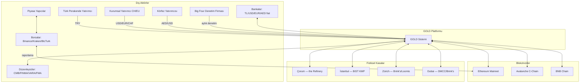
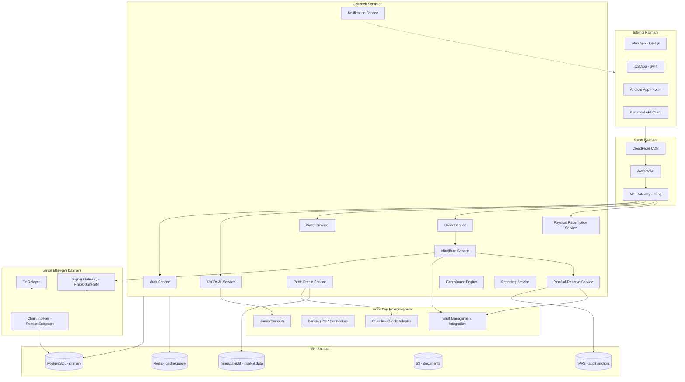
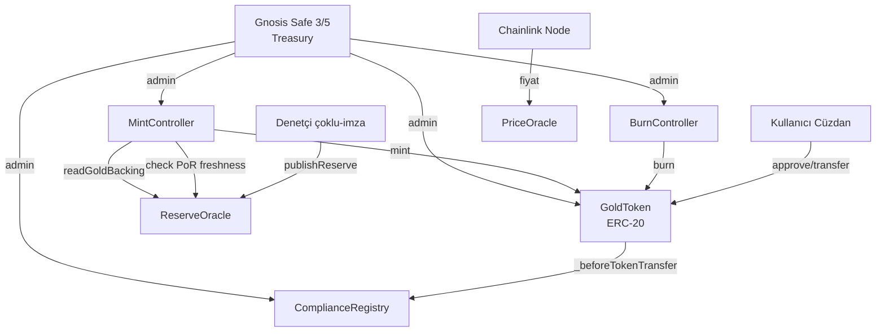
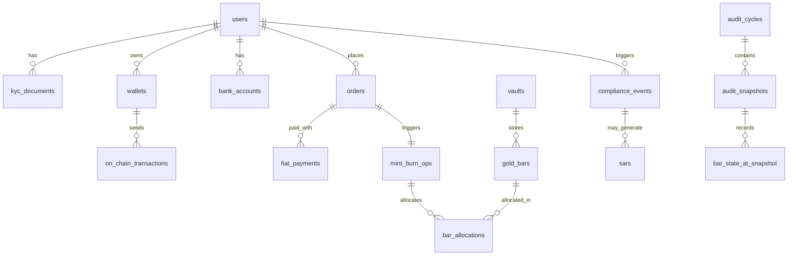
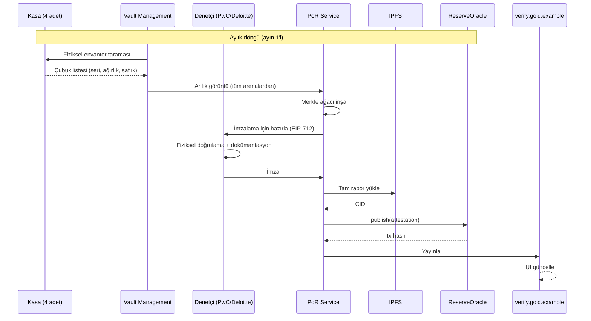
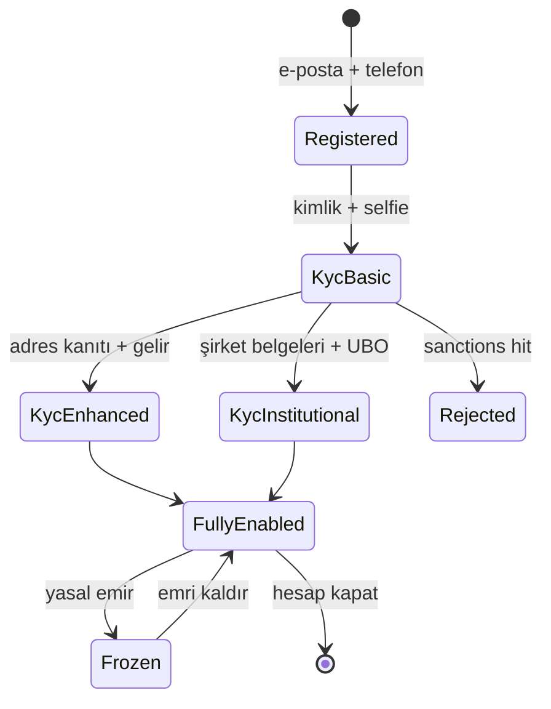
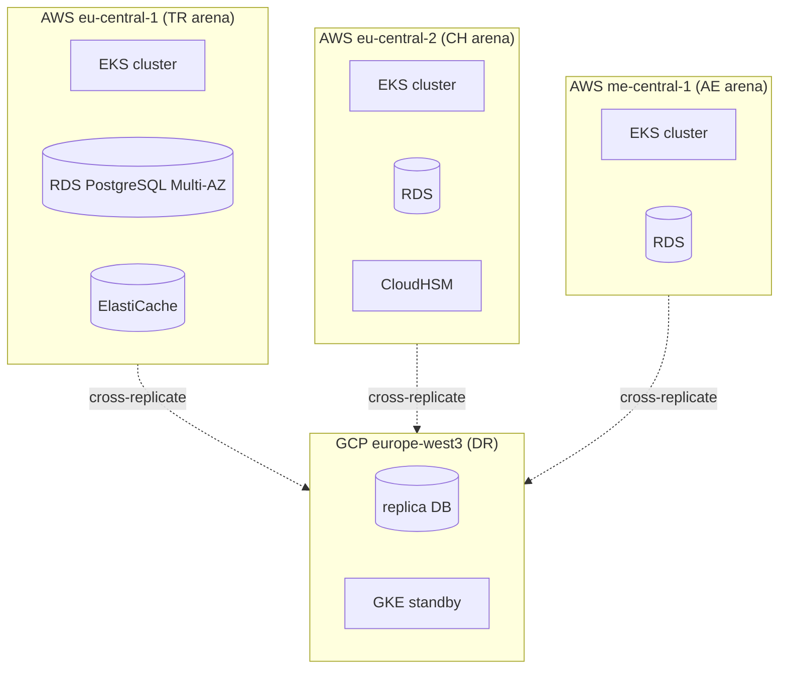

# GOLD — Sistem Tasarım Dokümanı

**GOLD Token | Küresel Sistem Mimarisi**
Sürüm 0.1 · Nisan 2026 · GİZLİ

---

## İçindekiler

1. [Yönetici Özeti](#1-yönetici-özeti)
2. [Sistem Bağlamı ve Üst Seviye Mimari](#2-sistem-bağlamı-ve-üst-seviye-mimari)
3. [Bileşen Envanteri](#3-bileşen-envanteri)
4. [Akıllı Sözleşme Tasarımı](#4-akıllı-sözleşme-tasarımı)
5. [Veri Modeli](#5-veri-modeli)
6. [Backend Servisleri ve API](#6-backend-servisleri-ve-api)
7. [Rezerv Kanıtı (Proof-of-Reserve) Sistemi](#7-rezerv-kanıtı-proof-of-reserve-sistemi)
8. [Uyum ve KYC Akışları](#8-uyum-ve-kyc-akışları)
9. [Güvenlik Mimarisi](#9-güvenlik-mimarisi)
10. [Altyapı ve Dağıtım](#10-altyapı-ve-dağıtım)
11. [Teknoloji Yığını Önerileri](#11-teknoloji-yığını-önerileri)
12. [Uygulama Yol Haritası](#12-uygulama-yol-haritası)
13. [Açık Sorular ve Karar Noktaları](#13-açık-sorular-ve-karar-noktaları)

---

## 1. Yönetici Özeti

Bu doküman, `Gold_Token_Global_Plan v2.0` stratejisini somut bir teknik sisteme dönüştürür. Hedef: 1 token = 1 gram fiziksel altına tahsisli, dört yetki alanında (TR/CH/AE/LI) işleyen, aylık bağımsız denetimli bir ERC-20 token platformu.

**Temel tasarım ilkeleri:**

- **Tahsisli (allocated) rezerv**: Her token, kasa envanterinde belirli bir altın çubuğa (seri no bazında) bağlı — fractional reserve yok.
- **Yetki alanı izolasyonu**: Her jurisdiction ayrı tüzel kişi, ayrı kasa, ayrı veri ikametgâhı. Akıllı sözleşme tek — uyum katmanında coğrafi kısıtlamalar.
- **Denetlenebilirlik birinci sınıf vatandaş**: Her basım/itfa → kasa hareket → denetim raporu → IPFS → zincir üstü hash zinciri.
- **Upgradability ile donma arasında denge**: Token sözleşmesi upgradable (UUPS proxy), kasa kontrol sözleşmeleri değişmez.
- **Taşımacılık kuralı (Travel Rule) yerli**: Uyum motoru tüm transferleri filtreler; sanctioned adresler ve KYC eksik cüzdanlar bloklanır.

---

## 2. Sistem Bağlamı ve Üst Seviye Mimari

### 2.1 Sistem Bağlamı (C4 Level 1)



### 2.2 Konteyner Diyagramı (C4 Level 2)



### 2.3 Yetki Alanı Dağıtım Topolojisi

Tek global sistem mantıksal olarak dört "arena"ya bölünür — her arena ayrı veri ikametgâhı ve uyum kuralları:

| Arena | Veri Bölgesi | Backend Deployment | Kasa | Fiat Sağlayıcı |
|---|---|---|---|---|
| TR | AWS `eu-central-1` (Frankfurt) + on-prem (İstanbul) | tr.api.gold.example | Çorum + BIST | Garanti, İş Bank PSP |
| CH | AWS `eu-central-2` (Zürich) | ch.api.gold.example | Brink's Zürich | Sygnum, SEBA |
| UAE | AWS `me-central-1` (UAE) | ae.api.gold.example | Brink's Dubai | ENBD, Mashreq |
| EU | AWS `eu-central-1` | eu.api.gold.example | Paylaşımlı Zürich | SEPA PSP (Stripe/Adyen) |

**Tek akıllı sözleşme — çoklu arena:** Kullanıcı hangi arenadan gelirse gelsin, basılan token aynı ERC-20 sözleşmesinde. Arena farkı sadece KYC/uyum/fiat katmanında.

---

## 3. Bileşen Envanteri

### 3.1 On-chain Bileşenler (Ethereum Mainnet + L2/alt-L1)

| Sözleşme | Sorumluluk | Upgradable? |
|---|---|---|
| `GoldToken` | ERC-20 token; transfer/approve/balanceOf; uyum hook'u | Evet (UUPS proxy) |
| `ComplianceRegistry` | KYC whitelist, jurisdiction tag, freeze list, travel rule mesaj hash'leri | Evet |
| `MintController` | Yalnızca yetkili mint; çoklu imza + PoR gated | Evet |
| `BurnController` | Kullanıcı veya saklama taleple yakım; itfa için | Evet |
| `ReserveOracle` | Son denetim raporu IPFS CID + zaman damgası + altın miktarı | Hayır (immutable append-only) |
| `PriceOracle` | Chainlink fiyat beslemesi (gold/USD, gold/TRY, gold/EUR) | Hayır (adapter) |
| `Treasury` (Gnosis Safe 3/5) | Sözleşme sahipliği, kritik parametre değişikliği | — (Safe) |

### 3.2 Zincir Dışı Backend Servisleri

| Servis | Sorumluluk | Teknoloji |
|---|---|---|
| Auth Service | OAuth2/OIDC, MFA, oturum, JWT | Keycloak veya Auth0 |
| KYC/AML Service | Kimlik doğrulama, PEP/sanction taraması, risk skorlaması | Node.js + Sumsub/Jumio |
| Wallet Service | Saklamalı cüzdan, MPC, self-custody köprüsü | Go + Fireblocks API |
| Order Service | Alım/satım/itfa emirleri, durum makinesi, iskonto | Go |
| Mint/Burn Service | Kasa tahsisi → on-chain mint; on-chain burn → kasa serbest | Go + ethers.js |
| Physical Redemption | 1kg+ fiziksel altın teslim talebi, kargo | Go |
| Price Oracle Service | Altın fiyat beslemesi toplama, manipülasyon tespiti | Python |
| Proof-of-Reserve Service | Denetim veri toplama, Merkle ağacı, IPFS yayını, on-chain anchor | Go |
| Compliance Engine | Seyahat Kuralı (TRP), işlem izleme kuralları, SAR üretimi | Go + ElasticSearch |
| Notification Service | E-posta/SMS/push, in-app | Node.js + SNS |
| Reporting Service | CMB günlük, MASAK şüpheli işlem, FINMA, vergi | Python + pandas |

### 3.3 İstemci Uygulamaları

- **Web** (Next.js + TypeScript + Tailwind): Tam fonksiyon — onboarding, alım/satım, itfa, portföy, PoR görünümü
- **iOS/Android** (native + shared business logic via Kotlin Multiplatform): Mobil odaklı — alım/satım, portföy, bildirim
- **Kurumsal API** (OpenAPI 3.1): Banka ve piyasa yapıcı entegrasyonu
- **PoR Public Portal** (`verify.gold.example`): Kamuya açık — cüzdan/çubuk sorgu, denetim raporu indirme

---

## 4. Akıllı Sözleşme Tasarımı

### 4.1 Sözleşme Grafiği



### 4.2 `GoldToken` Arayüzü

```solidity
// SPDX-License-Identifier: MIT
pragma solidity ^0.8.24;

// 1 token = 1 gram altın; 18 decimals ile alt-gram hassasiyet
interface IGoldToken is IERC20 {
    // Metadata
    function name() external view returns (string memory); // "GOLD Gold"
    function symbol() external view returns (string memory); // "GOLD"
    function decimals() external pure returns (uint8); // 18

    // Uyum kancası — her transferde ComplianceRegistry çağrılır
    function complianceRegistry() external view returns (address);

    // Acil durdurma — Treasury multisig ile
    function pause() external;
    function unpause() external;

    // Mahkeme emriyle dondurma — ComplianceRegistry.isFrozen ile okunur
    // Freeze/unfreeze ComplianceRegistry'de uygulanır, burada değil

    // Mint/Burn yetkileri sadece MintController/BurnController'da
    // Token'ın kendisinde direkt mint yoktur
}
```

**Transfer davranışı:**

```solidity
function _beforeTokenTransfer(address from, address to, uint256 amount) internal {
    require(!paused(), "paused");
    require(complianceRegistry.canTransfer(from, to, amount), "compliance");
    // canTransfer içinde: isKYC(from), isKYC(to), !isFrozen(from), !isFrozen(to),
    // sanctions check, jurisdictional restrictions
}
```

### 4.3 `ComplianceRegistry`

```solidity
interface IComplianceRegistry {
    enum KycTier { NONE, BASIC, ENHANCED, INSTITUTIONAL }

    struct WalletProfile {
        KycTier tier;
        bytes2 jurisdiction; // ISO-3166 alpha-2 ("TR","CH","AE","LI"...)
        uint64 kycExpiresAt;
        bool frozen;
        bytes32 travelRuleCounterpartyHash; // son doğrulanmış counterparty
    }

    function getProfile(address wallet) external view returns (WalletProfile memory);
    function canTransfer(address from, address to, uint256 amount) external view returns (bool);

    // Yalnızca KYCWriter rolü (KYC Service backend)
    function setProfile(address wallet, WalletProfile calldata profile) external;

    // Yalnızca ComplianceOfficer rolü (manuel inceleme)
    function freeze(address wallet, bytes32 reasonHash) external;
    function unfreeze(address wallet) external;

    // Seyahat Kuralı — büyük transferler için counterparty onayı gerekir
    function recordTravelRuleApproval(
        address from, address to, uint256 amount, bytes32 ivms101Hash
    ) external;

    event ProfileUpdated(address indexed wallet, KycTier tier, bytes2 jurisdiction);
    event Frozen(address indexed wallet, bytes32 reasonHash);
    event TravelRuleRecorded(address indexed from, address indexed to, bytes32 ivms101Hash);
}
```

### 4.4 `MintController`

**Kritik invaryant:** `totalSupply ≤ attestedGoldGrams` her zaman. Mint, sadece yeni çubuk kasaya girdikten ve denetçi onayından sonra.

```solidity
interface IMintController {
    struct MintRequest {
        address to;
        uint256 amount;          // gram * 1e18
        bytes32 allocationId;    // Mint/Burn Service'in ürettiği UUID
        bytes32[] barSerials;    // bu mint'i destekleyen kasa çubukları
        bytes32 jurisdictionTag; // "TR"|"CH"|"AE"|"LI"
    }

    // Çoklu imza: 3/5 (Hazine, Uyum Müdürü, Bağımsız Denetçi, Teknik, CIO)
    function proposeMint(MintRequest calldata req) external returns (bytes32 proposalId);
    function approveMint(bytes32 proposalId) external;
    function executeMint(bytes32 proposalId) external;

    // Güvenlik: son PoR taze olmalı (≤ 35 gün) VE
    // hedef totalSupply ≤ ReserveOracle.attestedGrams
}
```

### 4.5 `ReserveOracle`

**Append-only** — geçmişi silmek imkansız. Her ay denetçi, dört kasanın toplamını ve çubuk Merkle kökünü yayınlar.

```solidity
contract ReserveOracle {
    struct Attestation {
        uint64 timestamp;
        uint256 totalGrams;       // tüm kasaların toplamı
        bytes32 merkleRoot;       // çubuk bazında ağaç
        bytes32 ipfsCid;          // tam rapor
        address auditor;          // onaylayan denetçi firması adresi
        bytes signature;          // EIP-712 imzası
    }

    Attestation[] public attestations;

    function publish(Attestation calldata a) external onlyAuditor;
    function latest() external view returns (Attestation memory);
    function verifyBarInclusion(
        bytes32 barLeaf, bytes32[] calldata proof, uint256 attestationIndex
    ) external view returns (bool);
}
```

**Çubuk leaf formatı:**
```
keccak256(abi.encode(
    barSerial, weightGrams, purity999, vaultCode, refinerLBMAId
))
```

### 4.6 Yükseltilebilirlik Stratejisi

- **UUPS proxy** (ERC-1822 + OpenZeppelin): Token, ComplianceRegistry, MintController, BurnController
- **Immutable**: ReserveOracle (denetim geçmişinin değiştirilemezliği temel)
- **Yükseltme akışı**: Treasury Safe → 7 gün timelock → yeni implementation → yürütme
- Tüm yükseltmeler OpenZeppelin Defender + bağımsız bug bounty tarafından gözlemlenir

### 4.7 Çoklu zincir genişleme

Faz 4'te Avalanche C-Chain ve BNB Chain:

- **Kanonik zincir: Ethereum.** Diğer zincirlerdeki GOLD, kilit-basım köprüsü üzerinden.
- **Köprü:** LayerZero OFT (Omnichain Fungible Token) standardı — merkezi likidite havuzu riski yok.
- **PoR diğer zincirler için:** ReserveOracle Ethereum'da yaşar; diğer zincirlerdeki toplam arz köprü kilidi ile sınırlandırılır.

---

## 5. Veri Modeli

Yüksek seviyeli ERD (PostgreSQL primary):



### 5.1 Kritik Tablolar

**`users`**
```
id uuid PK
jurisdiction char(2)           -- TR/CH/AE/LI (birincil)
kyc_tier enum                  -- none/basic/enhanced/institutional
kyc_status enum                -- pending/approved/rejected/expired
risk_score int                 -- 0-100
pep_flag bool
sanctions_flag bool
created_at timestamptz
```

**`gold_bars`** — Ana rezerv kaydı
```
serial_no text PK              -- rafineri bazlı benzersiz
vault_id uuid FK
weight_grams decimal(12,4)     -- tipik 1000.0000 (1kg)
purity integer                 -- 9999 (%99.99)
refiner_lbma_id text           -- LBMA'da rafineri kimliği
cast_date date
status enum                    -- in_vault/allocated/in_transit/redeemed/burned
current_allocation_id uuid FK  -- hangi GOLD tahsisatına bağlı (null = free)
```

**`bar_allocations`** — Çubuk↔token bağı
```
id uuid PK
mint_op_id uuid FK
bar_serial text FK
allocated_grams decimal(12,4)  -- bir çubuğun tamamı veya fraksiyonu
allocated_at timestamptz
released_at timestamptz        -- burn/redeem olduğunda
```

**`mint_burn_ops`**
```
id uuid PK
type enum                      -- mint/burn
order_id uuid FK
amount_grams decimal(18,8)
chain_tx_hash text
status enum                    -- proposed/approved/executed/failed
proposer_id uuid FK
approvers jsonb                -- [{user_id, ts, sig}, ...]
jurisdiction char(2)
created_at timestamptz
executed_at timestamptz
```

**`audit_snapshots`** — Aylık denetim anlık görüntüsü
```
id uuid PK
cycle_id uuid FK
taken_at timestamptz
total_grams decimal(18,4)
merkle_root bytea(32)
ipfs_cid text
chain_tx_hash text             -- ReserveOracle.publish tx'i
auditor_firm text
auditor_signature bytea
```

**`on_chain_transactions`** — Tüm mint/burn/transfer'lerin kopyası
```
chain_id int
tx_hash text PK
block_number bigint
from_address text
to_address text
amount decimal(78,0)
log_index int
event_type enum                -- mint/burn/transfer/freeze
processed_at timestamptz
```

**`compliance_events`**
```
id uuid PK
user_id uuid FK
event_type enum                -- kyc_update/sanctions_hit/freeze/large_tx/structuring
severity enum                  -- info/warn/critical
payload jsonb
created_at timestamptz
resolved_at timestamptz
resolver_id uuid FK
```

### 5.2 Veri Bölütleme (Sharding/Partitioning)

- `on_chain_transactions` → `block_number` ile range partition (aylık)
- `compliance_events` → `created_at` ile monthly partition
- `users` → `jurisdiction` ile logical sharding (GDPR/veri ikametgâhı için)
  - TR kullanıcı kişisel verisi Türkiye içinde (KVKK)
  - CH kullanıcı verisi İsviçre içinde (nDSG)

---

## 6. Backend Servisleri ve API

### 6.1 Servis Sınırları

Her servis bir bounded context. Inter-service iletişim: gRPC (senkron) + NATS JetStream (event bus).

### 6.2 REST API Tasarımı (Public)

`BASE_URL = https://{jurisdiction}.api.gold.example/v1`

**Auth & Onboarding**
```
POST   /auth/register
POST   /auth/login
POST   /auth/2fa/verify
POST   /kyc/session              -> Sumsub/Jumio SDK token
GET    /kyc/status
POST   /kyc/documents
```

**Cüzdan**
```
GET    /wallets                  -> [{address, type, label}]
POST   /wallets                  -> custodial cüzdan oluştur
POST   /wallets/link             -> external (self-custody) adres bağla + imza doğrula
GET    /wallets/{addr}/balance
GET    /wallets/{addr}/history
```

**Alım/Satım/İtfa**
```
POST   /orders/buy               -> {amount_grams, fiat_currency, payment_method}
POST   /orders/sell              -> {amount_grams, fiat_currency, bank_account_id}
POST   /orders/redeem/physical   -> {amount_grams, delivery_address}  (min 1kg)
GET    /orders/{id}
GET    /orders                   -> listele, filtrele
POST   /orders/{id}/cancel
```

**Fiyat & Piyasa**
```
GET    /prices/gold              -> {USD, EUR, TRY, AED, CHF}
GET    /prices/gold/history?range=1d|7d|30d|1y
WS     /ws/prices                -> canlı fiyat akışı
```

**Rezerv Kanıtı**
```
GET    /reserves/latest          -> latest attestation
GET    /reserves/attestations    -> geçmiş
GET    /reserves/verify?bar={serial}  -> çubuk arama
GET    /reserves/verify?wallet={addr} -> bu cüzdanın tahsisi hangi çubuklarda
```

**Uyum (Compliance Officer iç)**
```
POST   /compliance/freeze
POST   /compliance/unfreeze
GET    /compliance/alerts
POST   /compliance/sar           -> MASAK/FINMA şüpheli işlem raporu
```

### 6.3 Event-Driven İç Akış

NATS subject'leri (`gold.{domain}.{event}`):

```
gold.order.created
gold.order.paid
gold.order.ready_to_mint
gold.mint.proposed
gold.mint.approved
gold.mint.executed
gold.mint.failed
gold.burn.executed
gold.compliance.alert
gold.kyc.approved
gold.kyc.rejected
gold.audit.snapshot.published
```

Outbox pattern: Her servis veritabanı ile event bus tutarlılığı için outbox tablosu kullanır; NATS publish atomik olarak DB commit sonrası.

### 6.4 İdempotency ve Tutarlılık

- Her yazma uç noktasında `Idempotency-Key` header'ı zorunlu
- Mint akışı saga pattern ile: `Order.Paid → ReserveGold → ProposeMint → ApproveMint → ExecuteMint → Settle`; her adımın compensation fonksiyonu var
- On-chain confirmation: 12 blok Ethereum'da (≈2.5 dk)

---

## 7. Rezerv Kanıtı (Proof-of-Reserve) Sistemi

### 7.1 Akış



### 7.2 Denetim Verisi Paketi

Her anlık görüntüde IPFS'e yüklenen paket:

```
/attestation-2027-07-01/
  ├── manifest.json         (meta + hash listesi)
  ├── bars.csv              (her çubuk satırı, imzalı)
  ├── merkle-tree.json      (tam ağaç, doğrulama için)
  ├── vault-photos/         (her çubuk fotoğrafı, coğrafi damgalı)
  ├── auditor-report.pdf    (Big Four imzalı PDF)
  ├── insurance-cert.pdf    (Lloyd's sigorta sertifikası)
  └── signatures.json       (denetçi EIP-712 imzaları)
```

### 7.3 Kullanıcı Doğrulama Akışı

**"Benim altınım hangi kasada?"** — Zincir üstü Merkle proof:

1. Kullanıcı `verify.gold.example`'a cüzdan adresini girer
2. Platform: bu cüzdanın `balance_grams` → hangi `bar_allocations` → hangi `gold_bars` → hangi `vault`
3. Her çubuk için son `audit_snapshot`'taki Merkle proof gösterilir
4. Kullanıcı proof'u ReserveOracle kontratında doğrulayabilir (manuel)

### 7.4 Frekans ve Taze Rezerv Kuralı

- Tam denetim: **Aylık** (Big Four)
- Anlık görüntü: **Günlük** (iç — PoR Service tarafından)
- `MintController` invaryant: son denetim ≤ 35 gün olmalı; aksi halde mint bloklanır

---

## 8. Uyum ve KYC Akışları

### 8.1 Yetki Alanına Göre KYC Matrisi

| Jurisdiction | Birincil Doğrulama | Ek | Risk Eşiği |
|---|---|---|---|
| TR | TC Kimlik + MERNİS + yüz eşleme | MASAK tarama | >75.000 TL/ay: enhanced |
| CH | Pasaport + Swiss eID opsiyonel | FINMA risk matrisi | >15.000 CHF/tx: enhanced |
| UAE | Emirates ID + pasaport | UAE PASS | >55.000 AED/tx: enhanced |
| LI/EU | Pasaport/eIDAS | MiCA CDD | >1.000 EUR/tx: CDD; >15.000 EUR: EDD |

### 8.2 Onboarding Akışı



### 8.3 Seyahat Kuralı (Travel Rule)

1.000 USD/EUR üstü transferlerde (FATF R.16) IVMS 101.202 mesajı zorunlu:

- **Çıkan transfer** (GOLD → external): Counterparty VASP'ye IVMS mesajı (TRP protokolü)
- **Gelen transfer** (external → GOLD): IVMS mesaj bekleme; gelmezse hold
- Provider önerisi: **Notabene** veya **Sumsub Travel Rule**

### 8.4 İşlem İzleme Kuralları

Compliance Engine kural motoru (örnek kurallar):

```
R001 sanctions_hit         → freeze + SAR
R002 velocity_spike        → >10x ortalama günlük hacim → alert
R003 structuring           → 24 saat içinde 10+ işlem, her biri eşik altında → alert
R004 high_risk_jurisdiction → FATF gri/kara liste → block
R005 large_single_tx       → >250k USD eşdeğer → enhanced review
R006 dormant_reactivation  → 180 gün uyku + büyük çekim → alert
R007 peer_anomaly          → counterparty cluster analizi → ML skor
```

Her alert → Compliance Officer kuyruğu → inceleme → eylem (onay/dondur/SAR).

### 8.5 Raporlama

| Rapor | Sıklık | Alıcı |
|---|---|---|
| Günlük işlem özeti | Günlük 07:00 TRT | CMB |
| MKK entegrasyonu | Gerçek zamanlı | MKK |
| Şüpheli İşlem (SAR) | Tetiklendikçe | MASAK |
| FINMA risk raporu | Üç aylık | FINMA (SRO aracılığıyla) |
| VARA faaliyet raporu | Üç aylık | VARA |
| MiCA ihraççı raporu | Üç aylık | FMA |
| Vergi raporu | Yıllık | GİB + kullanıcı |

---

## 9. Güvenlik Mimarisi

### 9.1 Tehdit Modeli (STRIDE özet)

| Tehdit | Aktör | Karşı önlem |
|---|---|---|
| Mint exploit | Dış saldırgan | Çoklu imza + PoR gated + formal verification + 3 audit |
| Vault iç tehdit | Çalışan | 4-göz kuralı, CCTV, dual control, çubuk-başı tag, aylık bağımsız denetim |
| Özel anahtar sızıntısı | İç/dış | HSM (AWS CloudHSM L3) + MPC (Fireblocks) + cold storage |
| Cüzdan faz saldırısı | Kullanıcı | Hardware wallet desteği, domain bağlama (EIP-712), phish alerts |
| Oracle manipülasyonu | Dış | Chainlink + 3+ beslemeden medyan + sapma koruyucu |
| Yeniden giriş (reentrancy) | Dış | OpenZeppelin ReentrancyGuard + checks-effects-interactions |
| Sybil KYC | Dış | Biyometrik + belge ağı analizi + vendor ortaklık |
| DoS (API) | Dış | CloudFlare + rate limit + WAF |
| Regülatör baskını | Devlet | Çoklu yetki alanı + İsviçre yedek |
| Supply chain (npm/go mod) | Dış | Pinned deps, SBOM, Snyk, iç artifact registry |

### 9.2 Anahtar Yönetimi

- **Treasury Safe sinyalleri**: Ledger hardware wallet, 5 farklı çalışan, 3 farklı lokasyon, 2 farklı jurisdiction
- **MintController imzaları**: HSM arkasında Fireblocks MPC veya Anchorage
- **Sıcak cüzdan**: Sadece ≤ %1 toplam arz, günlük operasyonel
- **Soğuk cüzdan**: Kalan; çok-imzalı, coğrafi dağıtılmış, geofencing alarmlı
- **Anahtar rotasyonu**: Yıllık + olay sonrası

### 9.3 Denetim ve İzleme

- **SIEM**: AWS Security Hub + Panther
- **Zincir izleme**: Forta ajanları (unusual transfer, freeze, ownership)
- **Gözlemlenebilirlik**: Datadog + OpenTelemetry + Sentry
- **Incident response runbook**: RTO 1h, RPO 5min
- **Bug bounty**: Immunefi, kritik $500k, yüksek $100k

### 9.4 Güvenlik Denetimleri

- **Akıllı sözleşmeler**: OpenZeppelin + Trail of Bits + Spearbit (3 bağımsız)
- **Backend**: NCC Group (yıllık)
- **Penetration test**: İki yılda bir kırmızı takım
- **SOC 2 Type II**: Yıl 2'de

---

## 10. Altyapı ve Dağıtım

### 10.1 Cloud Topolojisi

**Primary**: AWS. **DR**: GCP (cross-cloud DR).



### 10.2 Ortamlar

- `local` — Docker Compose, tüm servisler + Anvil (Ethereum)
- `dev` — Otomatik her PR
- `staging` — Sepolia testnet + gerçek vendor sandbox
- `prod` — Mainnet, 3 arena
- `audit` — Read-only kopya, denetçi erişimi

### 10.3 CI/CD

- GitHub Actions
- Smart contract pipeline: Foundry test → Slither → Echidna → deploy script
- Backend: build → unit → integration → e2e → deploy
- Kanarya dağıtım (%1 → %10 → %50 → %100)
- Tüm üretim dağıtımları manuel onay + change ticket

### 10.4 Felaket Kurtarma

| Senaryo | RTO | RPO | Strateji |
|---|---|---|---|
| Region outage | 1h | 5min | Cross-region failover |
| Vault fiziksel kayıp | — | — | Lloyd's sigorta $500M |
| Smart contract exploit | Minutes | 0 | pause() + Treasury acil |
| KYC vendor kesinti | 4h | — | İkincil vendor (Jumio ↔ Sumsub) |
| Blokzincir outage | — | — | Pause, alternatif zincire geçiş planı |

---

## 11. Teknoloji Yığını Önerileri

| Katman | Seçim | Alternatif | Neden |
|---|---|---|---|
| Smart contract dili | Solidity 0.8.24 | Vyper | Ekosistem, audit pool |
| SC framework | Foundry | Hardhat | Hız, Rust native |
| SC kütüphane | OpenZeppelin + Solady | — | Audit'lenmiş, standard |
| Oracle | Chainlink | Pyth | En olgun PoR desteği |
| Bridge (Faz 4) | LayerZero OFT | Wormhole | Azaltılmış merkezi risk |
| Custody | Fireblocks | BitGo, Anchorage | MPC + policy engine |
| Indexer | Ponder | The Graph | TypeScript, postgres native |
| Backend dili | Go (servisler) + TypeScript (BFF) | Java, Rust | Operasyon kolay, konkurans |
| Veritabanı | PostgreSQL 16 | — | ACID, zengin özellik |
| Time-series | TimescaleDB | InfluxDB | Postgres'te |
| Cache/queue | Redis + NATS JetStream | Kafka, SQS | Hafif, streaming |
| API gateway | Kong | AWS API GW | Self-host, zengin plugin |
| Auth | Keycloak (self-host) | Auth0 | Veri ikametgâhı kontrolü |
| KYC | Sumsub + Jumio (dual) | Onfido | Arena başına en iyi |
| Web frontend | Next.js 15 + Tailwind + shadcn | — | SEO, hızlı |
| Mobile | Swift (iOS) + Kotlin (Android) + KMP shared | Flutter | Native performans |
| Observability | Datadog | Grafana Cloud | End-to-end |
| IaC | Terraform + Terragrunt | Pulumi | Sektör standardı |
| Container | Kubernetes (EKS) | ECS | Çoklu-cloud taşınabilir |
| Secret mgmt | AWS Secrets + HashiCorp Vault | — | Hibrit |

---

## 12. Uygulama Yol Haritası

### Faz 0 — Temel (Ay 0–2)

- Tech lead + 2 smart contract eng + 2 backend + 1 SRE işe alımı
- Ethereum testnet'te `GoldToken` + `ComplianceRegistry` + `MintController` iskeleti
- Local dev ortamı (docker-compose) + CI
- Security threat model workshop
- KYC/kasa vendor POC (Sumsub + Fireblocks)

### Faz 1 — MVP TR Arena (Ay 2–6)

- TR jurisdiction uçtan uca: onboarding → TRY giriş → mint → custodial wallet → sell → TRY çıkış
- Tek kasa: Çorum
- Manuel PoR (aylık spreadsheet + manuel imza)
- Iç alpha (çalışan testi)
- CMB pre-filing

### Faz 2 — PoR Otomasyonu + CH Arena (Ay 6–10)

- Otomatik PoR: ReserveOracle deploy, Merkle ağacı, IPFS yayın
- Zürih kasa entegrasyonu
- USD/EUR/CHF rampa
- FINMA SRO başvurusu
- İlk dış güvenlik denetimi
- Staging (Sepolia) public beta

### Faz 3 — Mainnet Lansman (Ay 10–14)

- Ethereum mainnet dağıtımı (Treasury Safe devir)
- İkinci + üçüncü güvenlik denetimi tamam
- $10M başlangıç rezerv → mint
- TR + CH arenaları canlı
- 1–2 borsada listeleme + 1 piyasa yapıcı
- verify.gold.example public

### Faz 4 — Küresel Ölçekleme (Ay 14–24)

- Dubai VARA lisansı + arena
- Liechtenstein/MiCA
- Avalanche + BNB köprü
- DEX likidite havuzları
- Kurumsal API + banka ortaklıkları
- Şeriat uyumlu varyant

### Faz 5 — Olgunlaşma (Ay 24+)

- L2 (Base/Arbitrum) genişleme
- Tokenize altın ETF köprüsü
- Yield/staking varyantları (altın leasing)
- Açık finansal API (kimlik doğrulaması ile)

---

## 13. Açık Sorular ve Karar Noktaları

> Güncelleme: Nisan 2026 toplantısında 4 madde karara bağlandı. ✅ ile işaretlenmiş olanlar kesinleşmiş kararlar; ⏳ hala açık.

1. **Basım birim hassasiyeti** — ✅ **18 decimals**. DeFi uyumu + alt-gram fraksiyonu için.
2. **Self-custody izni** — ✅ **Jurisdiction bazlı**: TR'de custodial-only (CMB yönelimi), CH/AE/LI'de Enhanced KYC sonrası self-custody. `ComplianceRegistry.jurisdiction` tag üzerinden backend enforce eder. CMB farklı görüş bildirirse kolay toggle.
3. **Minimum alım** — ✅ **1 gram operasyonel minimum** (sipariş bazında). Zincirde ve ikincil piyasada (DEX/borsa) fraksiyon serbest.
4. **Yakım onayı** — ⏳ Öneri: <100gr otomatik, üstü onaylı. Burada sonra değerlendirilecek.
5. **Fiziksel itfa minimum** — ✅ **1kg**. LBMA çubuk bölme maliyeti; tek-çubuk-tek-talep operasyonu.
6. **Bridge güvenlik modeli** — ✅ **Faz 4'te yeniden değerlendirilecek**. 18 ay sonra LayerZero v2 / CCIP 2 / native restaking manzarası bugünkünden farklı. Sözleşmeler bridge'e bağımlı değil. Geçici default: LayerZero OFT (değiştirilebilir).
7. **Türkiye'de custodial-only** — ✅ (#2 ile birlikte) — CMB teyit edilene kadar TR için custodial varsayılan.
8. **KVKK veri ikametgâhı** — ⏳ Türk kullanıcı KYC verisi Türkiye dışına çıkabilir mi? Hukuki görüş bekleniyor.
9. **Gas ödeme modeli** — ⏳ Kullanıcı ETH mı öder, meta-tx (EIP-2771) mi? Öneri: EIP-2612 permit v1, meta-tx + paymaster v2.
10. **L2 stratejisi** — ⏳ İlk lansman sadece Ethereum mainnet mi, yoksa day-1 Base/Arbitrum da mı? Öneri: sadece mainnet, odak.

---

## Ekler

### Ek A — Ekip ve Organizasyon

Önerilen başlangıç takımı (Ay 0–6):

- Tech Lead / Chief Architect
- 2 × Smart Contract Engineer
- 3 × Backend Engineer (Go)
- 1 × Frontend Lead (Next.js)
- 2 × Mobile Engineer (iOS + Android)
- 1 × SRE / DevOps
- 1 × Security Engineer
- 1 × QA / Test Engineer
- 1 × Product Manager
- 1 × Compliance Tech Liaison

Faz 2+: KYC ops, support, business development, data analyst.

### Ek B — Sözleşme Adres Defteri (prod için)

Mainnet deployment sonrası buraya eklenecek. Her adres etherscan.io linkli, Safe Transaction Service kaydı ile.

### Ek C — İlgili Dokümanlar

- `Gold_Token_Global_Plan.pdf` (v2.0, Nisan 2026) — stratejik temel
- `threat-model.md` — detaylı STRIDE analizi (TBD)
- `smart-contracts/README.md` — kontrat spec detayı (TBD)
- `runbooks/` — incident response (TBD)
- `compliance/playbook-{tr|ch|ae|li}.md` (TBD)

---

**BELGE SONU — v0.1**

Sonraki yineleme için: bu doküman tartışma temeli. Her bölümü ayrı bir teknik spec'e dönüştürmek Faz 0'ın çıktısıdır.
